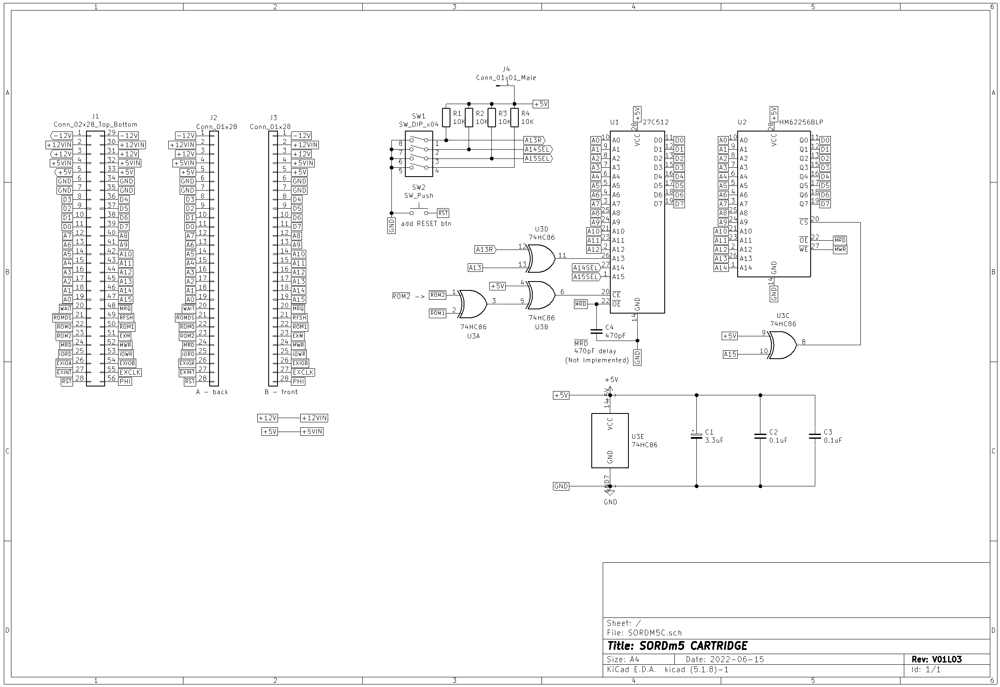
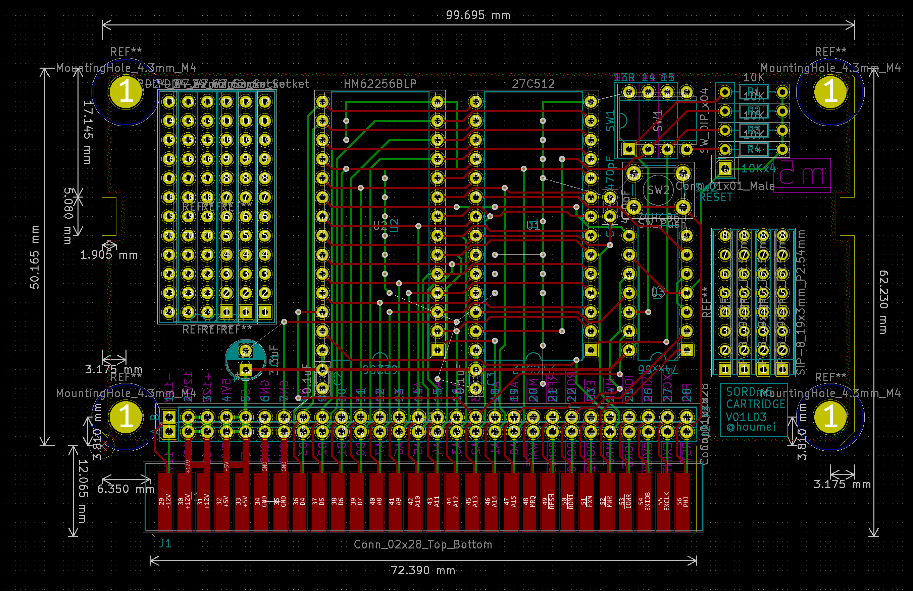

# SORDM5C - Cartridge board for SORD m5 (KiCad5)

Schematic

PCB

## 説明

  

## 履歴
V01L01(非公開) 初版 ROMデコードの配線ミスあり  
V01L02(非公開) V01L01のデコード修正　リセットボタン追加  
V01L03 リセットボタンの形状変更　カードエッジの位置をずらしケースとの干渉を改善　回路図はV01L02と変わらず    

## SORDM5CV01L03GB - Gerber
JLCPCBなどにそのまま出図可能です。  
